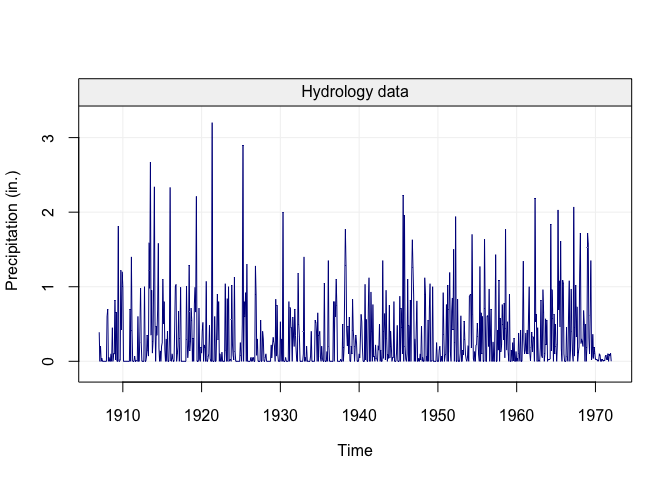
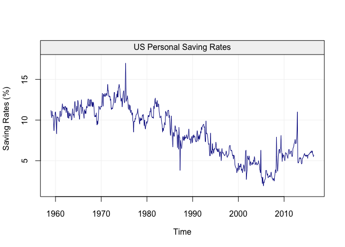

<!-- README.md is generated from README.Rmd. Please edit that file -->
`simts` R Package
=================

This repository holds the Time Series Simulation (simts) R package.

Below are examples of the capabilities of the `simts` package.

We can generate different types of time series data:

``` r
library(smacdata)
data("hydro")
hydro = gts(as.vector(hydro), start = 1907, freq = 12, unit_ts = "in.", 
            name_ts = "Precipitation", data_name = "Hydrology data")
plot(hydro)
```



``` r
data("savingrt")
savingrt = gts(as.vector(savingrt), start = 1959, freq = 12, unit_ts = "%", 
            name_ts = "Saving Rates", data_name = "US Personal Saving Rates")
plot(savingrt)
```



Install Instructions
====================

To install the `simts` package, there is currently one option: GitHub (Developmental).

Recommended R Interface
-----------------------

We firmly recommend that any users of this package use the [RStudio IDE](https://www.rstudio.com/products/rstudio/download/) over the default R GUI.

Installing the package through GitHub (Developmental)
-----------------------------------------------------

For users who are interested in having the latest and greatest developments withing wavelets or simts methodology, this option is ideal. Though, there is considerably more work that a user must do to have a stable version of the package. **The setup to obtain the development version is platform dependent.**

Specifically, one **must** have a compiler installed on your system that is compatible with R.

For help on obtaining a compiler consult:

-   [OS X](http://thecoatlessprofessor.com/programming/r-compiler-tools-for-rcpp-on-os-x/)
-   [Windows](https://cran.r-project.org/bin/windows/Rtools/)

Depending on your operating system, further requirements exist such as:

**OS X**

Some user report the need to use X11 to suppress shared library errors. To install X11, visit [xquartz.org](http://www.xquartz.org/)

**Linux**

Both curl and libxml are required.

For **Debian** systems, enter the following in terminal:

``` bash
sudo apt-get install curl libcurl3 libcurl3-dev libxml2 libxml2-dev
```

For **RHEL** systems, enter the following in terminal:

``` bash
sudo yum install curl curl-devel libxml2 libxml2-dev
```

**All Systems**

With the system dependency taken care of, we continue on by installing the R specific package dependencies and finally the package itself by doing the following in an R session:

``` r
# Install dependencies
install.packages(c("RcppArmadillo","ggplot2","reshape2","devtools","knitr","rmarkdown"))

# Install the package from GitHub without Vignettes/User Guides
devtools::install_github("SMAC-Group/simts")
```

Supplementary data package
--------------------------

To test the package performance on real-world data that is *stationary* or work with some of the examples, you will need to download and install the `imudata` and/or the `datapkg` R package.

To do so, please use the following installation method within the `simts` R package:

``` r
# Install the imudata package containing real world IMU data sets
simts::install_imudata()

# Install the datapkg package containing miscellaneous data sets
simts::install_datapkg()
```

For more information about the `imudata` and `datapkg` package, see the <https://github.com/SMAC-Group/imudata> and <https://github.com/SMAC-Group/datapkg>.
